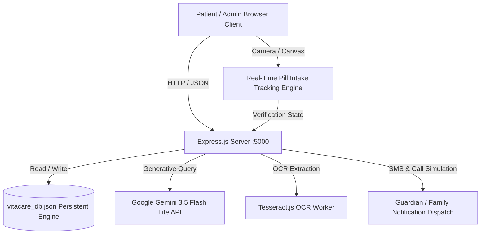

# VitaCare AI – Overall Coding Architecture & System Reference

## 1. System Overview & Architecture

VitaCare AI is an intelligent healthcare management and assistive medical companion platform built with a high-performance modern stack:
- **Frontend**: React 19 + Vite 8 + Lucide Icons + Native HTML5 Canvas Computer Vision & MediaDevices API.
- **Backend**: Node.js + Express 5 + JSON Persistent DB Engine + Tesseract.js OCR.
- **AI Engine**: Google Gemini Generative AI (`gemini-3.5-flash-lite`) integrated with structured clinical context grounding and safety triage protocols.
- **Multi-Language Engine**: 8 Indian languages (English, Tamil, Telugu, Malayalam, Kannada, Hindi, Bengali, Marathi) with synchronized frontend and backend localization dictionaries.
- **Pill Intake Tracking Engine**: Real-time camera canvas processing pipeline tracking patient face verification, hand movement towards mouth, swallowing confirmation, and water intake with automated guardian SMS alerts.



---

## 2. Complete Project Directory Structure

```text
d:\vitacare-ai\
├── README.md                              # Project documentation
├── OVERALL_CODING_GUIDE.md                # Master architectural and coding reference (this file)
│
├── backend\
│   ├── .env                               # Environment configurations (Port, JWT, Gemini API Key)
│   ├── server.js                          # Express application entrypoint, middleware, and route mounting
│   ├── db.js                              # JSON database abstraction layer with CRUD, atomic writes, schema models
│   ├── package.json                       # Backend dependencies (express, cors, bcryptjs, jsonwebtoken, multer, tesseract.js)
│   ├── reset_dev_data.js                  # Standalone reset script for development database
│   │
│   ├── routes\
│   │   ├── authRoutes.js                  # Authentication, registration, login, and user profile management
│   │   ├── adminRoutes.js                 # Admin management, CMS config, branding, database wipe/reset endpoints
│   │   ├── aiCopilotRoutes.js             # AI Copilot chat endpoints with mode selection & language support
│   │   ├── dashboardRoutes.js             # Unified health score, today's schedule, vitals, summary analytics
│   │   ├── medicineRoutes.js              # Medication CRUD, intake verification, scheduled dose tracking
│   │   ├── reportRoutes.js                # Medical report upload, OCR analysis, biomarker extraction, compare
│   │   ├── prescriptionRoutes.js          # Prescription upload, OCR medicine detection, schedule auto-generation
│   │   ├── healthRoutes.js                # Vitals logging (BP, Blood Glucose, SpO2, Heart Rate)
│   │   ├── guardianRoutes.js              # Guardian contact management, alert subscriptions
│   │   ├── emergencyRoutes.js             # SOS alert triggering, emergency contact dispatch
│   │   ├── timelineRoutes.js              # Consolidated chronological medical event timeline
│   │   ├── careconnectRoutes.js           # Telehealth session coordination and doctor consultations
│   │   ├── notificationRoutes.js          # Patient notifications, dose reminders, safety alerts
│   │   └── demoRoutes.js                  # Demonstration data generation (for sandbox testing)
│   │
│   ├── services\
│   │   ├── aiCopilotService.js            # Gemini API integration, clinical prompt grounding, emergency triage
│   │   ├── medicineStateMachine.js        # Strict sequential state machine for pill intake verification
│   │   ├── consumptionTrackerService.js   # Session management for camera-based intake verification
│   │   ├── smsService.js                  # Multi-trigger SMS alert dispatcher with localized templates
│   │   ├── callService.js                 # Voice call escalation simulation service
│   │   ├── ocrService.js                  # Tesseract OCR engine for medical lab reports & prescriptions
│   │   ├── extractionService.js           # Regex & clinical heuristic extraction for biomarkers and dosages
│   │   ├── scheduleGenerator.js           # Automated daily schedule creation from prescription frequencies
│   │   ├── alertEscalationService.js      # Automated escalation for missed medications
│   │   └── demoDataService.js             # Sandbox test data generator
│   │
│   └── data\
│       └── vitacare_db.json               # Active database store file
│
└── frontend\
    ├── index.html                         # HTML5 template with Google Fonts (Inter, Plus Jakarta Sans)
    ├── vite.config.js                     # Vite build configuration (React plugin, dev server port 3000)
    ├── package.json                       # Frontend dependencies (react 19, react-dom 19, lucide-react, vite)
    │
    └── src\
        ├── main.jsx                       # React DOM root render
        ├── App.jsx                        # Main application controller, routing, global modal orchestration
        ├── index.css                      # Global design system, modern gradients, dark/light themes, typography
        ├── App.css                        # App-specific animations and UI utilities
        │
        ├── api\
        │   └── client.js                  # Axios/Fetch API client wrapper with JWT token interception
        │
        ├── context\
        │   └── LanguageContext.jsx        # Multi-language translation context supporting 8 Indian languages
        │
        ├── components\
        │   ├── Navbar.jsx                 # Top navigation bar with active route highlighting & branding
        │   ├── TopHeader.jsx              # Header with SOS trigger, language selector, and notification bell
        │   ├── Sidebar.jsx                # Responsive navigation sidebar
        │   ├── PillConsumptionTrackerModal.jsx # Real-time computer vision pill intake tracking modal
        │   ├── ReportViewerModal.jsx      # High-fidelity lab report viewer with extracted biomarkers & trends
        │   ├── ReportUploadModal.jsx      # Lab report file upload & OCR extraction modal
        │   ├── PrescriptionUploadModal.jsx# Prescription upload modal with automatic medication extraction
        │   ├── MedicineReminderModal.jsx  # Dose reminder alert popup
        │   ├── EmergencySosModal.jsx      # Urgent SOS confirmation modal alerting guardians & 108/911
        │   ├── CareConnectModal.jsx       # Virtual doctor teleconsultation session modal
        │   └── NotificationDrawer.jsx     # Slide-out drawer displaying system alerts and notifications
        │
        └── views\
            ├── DashboardView.jsx          # Primary patient dashboard (health score, upcoming doses, quick vitals)
            ├── MedicinesView.jsx          # Medication manager, schedules, adherence percentage, manual dose logs
            ├── ReportsView.jsx            # Lab reports library, biomarker extraction history, upload triggers
            ├── CompareReportsView.jsx     # Side-by-side metric comparison between two lab reports
            ├── HealthTrackerView.jsx      # Vitals logging and physiological trend tracking
            ├── HealthTrendsView.jsx       # Graphical biomarker analytics over time
            ├── AiCopilotView.jsx          # AI Health Copilot chat with Simple/Standard/Detailed clinical modes
            ├── GuardianView.jsx           # Guardian details, alert preferences, SMS log audit
            ├── AlertHistoryView.jsx       # Audit log of triggered medicine reminders and missed dose alerts
            ├── AdherenceView.jsx          # Detailed adherence metrics and compliance streaks
            ├── TimelineView.jsx           # Unified chronological patient health event history
            ├── CareConnectView.jsx        # Telehealth consultation appointments and doctor directory
            ├── AdminPanelView.jsx         # System administration (website branding, CMS, database reset, logs)
            └── AuthView.jsx               # Login and registration view for patients and administrators
```

---

## 3. Database Schema Design (`backend/db.js`)

The database engine utilizes a structured, atomic JSON store (`vitacare_db.json`) with strict collections:

1. **`users`**:
   - `id`, `name`, `email`, `password` (bcrypt hash), `role` (`'patient' | 'admin' | 'guardian'`), `bloodGroup`, `phone`, `preferredLanguage`, `createdAt`.
2. **`user_profiles`**:
   - `id`, `userId`, `dob`, `gender`, `emergencyContactName`, `emergencyContactPhone`, `allergies`, `chronicConditions`, `doctorName`, `doctorPhone`.
3. **`medicines`**:
   - `id`, `userId`, `name`, `dosage`, `frequency` (`'Once daily'`, `'Twice daily'`, etc.), `instructions`, `startDate`, `endDate`, `isActive`, `timing` (`['morning', 'night']`).
4. **`medicine_schedules`**:
   - `id`, `userId`, `medicineId`, `medicineName`, `dosage`, `scheduledDate`, `scheduledTime`, `status` (`'upcoming' | 'taken' | 'missed'`), `takenAt`, `verificationMethod`.
5. **`health_reports`**:
   - `id`, `userId`, `reportType`, `labName`, `reportDate`, `fileUrl`, `fileName`, `extractedValues` (array of metrics), `verifiedByPatient`, `status`.
6. **`extracted_health_values`**:
   - `id`, `reportId`, `userId`, `metricName`, `value`, `unit`, `referenceRange`, `status` (`'normal' | 'low' | 'high' | 'critical'`).
7. **`vitals`**:
   - `id`, `userId`, `metricName`, `value`, `unit`, `referenceRange`, `date`, `time`, `notes`.
8. **`guardians`**:
   - `id`, `userId`, `name`, `relationship`, `phone`, `email`, `notifyOnMissed`, `notifyOnTaken`, `notifyOnSos`, `isPrimary`.
9. **`ai_conversations`**:
   - `id`, `userId`, `role` (`'user' | 'assistant'`), `content`, `mode`, `language`, `createdAt`.
10. **`sms_logs` / `call_logs`**:
    - `id`, `userId`, `recipientPhone`, `recipientName`, `messageType`, `content`, `status`, `sentAt`.
11. **`system_settings`**:
    - `id`, `websiteName`, `logoUrl`, `defaultLanguage`, `supportPhone`, `supportEmail`, `careConnectEnabled`.
12. **`cms_modules` / `cms_cards` / `translations`**:
    - Platform display modules, customizable feature cards, and multi-language dictionary items.

---

## 4. Key Implementation Highlights

### 4.1. Real-Time Camera Pill Intake State Machine
File: [`frontend/src/components/PillConsumptionTrackerModal.jsx`](file:///d:/vitacare-ai/frontend/src/components/PillConsumptionTrackerModal.jsx) & [`backend/services/medicineStateMachine.js`](file:///d:/vitacare-ai/backend/services/medicineStateMachine.js)

The pill intake detection uses a strict, reliable sequential state machine:
1. **`INIT` / `CAMERA_REQUEST`**: Access user media stream (`video` element + hidden analysis `canvas`).
2. **`FACE_ALIGNMENT`**: Analyzes facial oval bounds, skin luminance, and stability. Requires sustained presence before advancing.
3. **`TABLET_INTAKE` & `HAND_MOVEMENT`**: Displays exact scheduled tablet instructions. Tracks user's hand trajectory moving toward the mouth bounding box.
4. **`MOUTH_PROXIMITY` & `SWALLOWING`**: Detects hand-to-mouth contact and brief pause indicating ingestion.
5. **`WATER_INTAKE`**: Prompt instructs: *"Please drink water to complete the medication intake process."* Once water motion is verified, transitions to completion.
6. **`VERIFIED_COMPLETE`**: Marks the dose as `taken` in `medicine_schedules`, creates an adherence log, and automatically triggers an SMS confirmation to the patient's registered guardian.

### 4.2. Google Gemini 3.5 Flash Lite Clinical AI Copilot
File: [`backend/services/aiCopilotService.js`](file:///d:/vitacare-ai/backend/services/aiCopilotService.js)

```javascript
// Google Gemini Generative Language API Endpoint
const apiKey = process.env.GEMINI_API_KEY; // Loaded securely from backend/.env
const model = process.env.GEMINI_MODEL || 'gemini-3.5-flash-lite';
const url = `https://generativelanguage.googleapis.com/v1beta/models/${model}:generateContent?key=${apiKey}`;
```
- **Emergency Triage**: First intercepts critical medical symptoms (acute chest pain, stroke, severe respiratory distress) to provide urgent 911/108 SOS instructions and safety disclaimers.
- **Context Injection**: Gathers active medications, today's pending doses, recent vitals, and lab reports into a structured clinical grounding prompt.
- **Response Modes**:
  - `simple`: Conversational, analogy-driven, accessible for elderly patients.
  - `standard`: Balanced medical summary with dosage instructions.
  - `detailed`: Deep physiological and biochemical analysis with clinical reference intervals.
- **Multilingual**: Dynamically answers in English, Tamil, Telugu, Malayalam, Kannada, Hindi, Bengali, or Marathi.

---

## 5. Primary API Routes Reference

| Method | Endpoint | Description |
| :--- | :--- | :--- |
| `POST` | `/api/auth/register` | Register a new patient account |
| `POST` | `/api/auth/login` | Authenticate patient or administrator, returns JWT |
| `GET` | `/api/dashboard` | Fetch consolidated patient health overview, scores, and schedule |
| `GET` | `/api/medicines` | Retrieve active patient medications |
| `POST` | `/api/medicines` | Add a new medication regimen |
| `POST` | `/api/medicines/verify-intake` | Confirm and record verified pill consumption event |
| `POST` | `/api/medicines/guardian-notify` | Dispatch SMS alert to registered guardian |
| `GET` | `/api/reports` | List patient's uploaded diagnostic reports |
| `POST` | `/api/reports/upload` | Upload PDF or image report for automated OCR extraction |
| `GET` | `/api/reports/compare` | Compare two health reports side-by-side |
| `POST` | `/api/ai/chat` | AI Copilot conversational query with clinical grounding |
| `POST` | `/api/emergency/sos` | Trigger emergency SOS broadcast to family & emergency services |
| `POST` | `/api/admin/database/clear-user-data` | Clear all test/patient data to fresh empty state |
| `GET` | `/api/settings/public` | Retrieve global branding name, logo, and language settings |

---

## 6. How to Run Locally

### Backend Server
```powershell
cd d:\vitacare-ai\backend
node server.js
# Runs on http://localhost:5000
```

### Frontend Server
```powershell
cd d:\vitacare-ai\frontend
npm run dev
# Runs on http://localhost:3000
```

### Portal URLs
- **Patient / User Portal**: `http://localhost:3000/` (or `http://localhost:3000/?mode=user`)
- **Admin Portal**: `http://localhost:3000/?mode=admin` (or `http://localhost:3000/#/admin`)
- **Admin Default Login**:
  - Email: `admin@vitacare.ai`
  - Password: `AdminSecure2026!`
